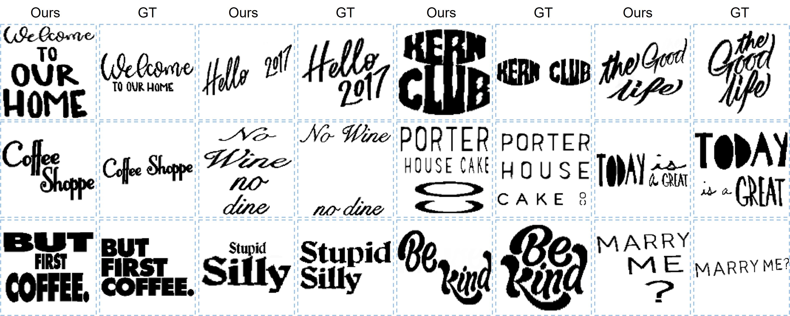
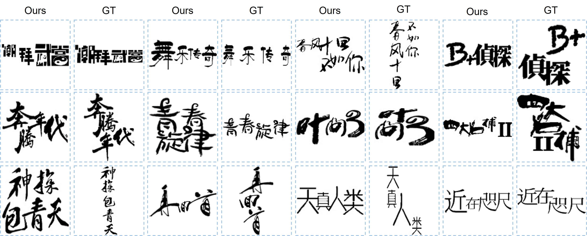
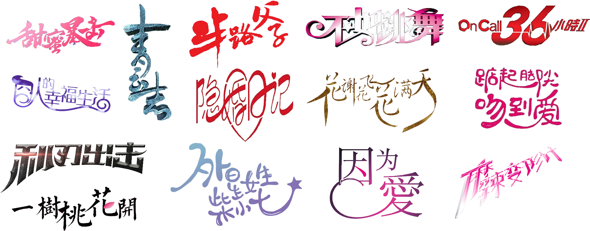
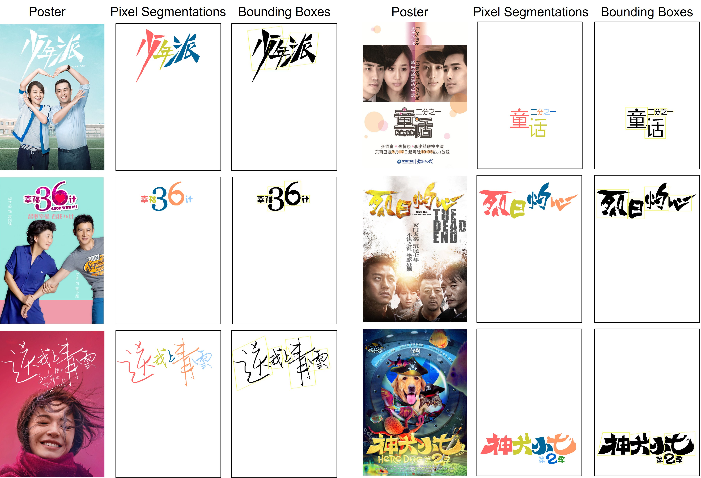

# TextLogoLayout

This is the official Pytorch implementation of the paper:

Aesthetic Text Logo Synthesis via Content-aware Layout Inferring. CVPR 2022.

Paper: [arxiv](https://arxiv.org/abs/2204.02701)
Supplementary: Link (will be uploaded soon)

## Demo
Our model takes glyph images and their corresponding texts as input and synthesizes aesthetic layouts for them automatically.

English Results:
<div align=center>
	 
</div>

Chinese Results:
<div align=center>
	 
</div>

## Dataset
### TextLogo3K Dataset
We construct a text logo dataset named as TextLogo3K by collecting data from Tencent Video, one of the leading online video platforms in China.
The dataset consists of 3,470 carefully-selected text logo images that are extracted from the posters/covers of the movies, TV series, and comics. 

<div align=center>
	 
</div>

We manually annotate the bounding box, pixel-level mask, and category for each character in those text logos.

<div align=center>
	 
</div>

Download link: [Google Drive](https://drive.google.com/drive/folders/1FofGxAbpXp2Jjfz-mROsqwpOvL8SKpuE?usp=sharing), [PKU Disk](https://disk.pku.edu.cn:443/link/7201CADEA4E0A3B977D71228B5CCABE8) (Password: 1VEn)

Please download it, unzip it, and put the folder 'TextLogo3K' under './dataset/'.

**Please note that this dataset CAN ONLY be used for academic purpose.**

In addition to the layout synthesis problem addressed in our paper, our dataset can also be adopted in many tasks, such as (1) **text detection/segmentation**, (2) **texture transfer**, (3) **artistic text recognition**, and (4) **artistic font generation**.

### English Dataset
The English dataset we used is from TextSeg (Rethinking Text Segmentation: A Novel Dataset and A Text-Specific Refinement Approach, CVPR 2021).
Please follow the instructions in its [homepage](https://github.com/SHI-Labs/Rethinking-Text-Segmentation) to request the dataset.

## Training and Testing

Our code will be released very soon.

## Citation

If you use this code or find our work is helpful, please consider citing our work:
```
@inproceedings{wang2021aesthetic,
  title={Aesthetic Text Logo Synthesis via Content-aware Layout Inferring},
  author={Wang, Yizhi and Pu, Gu and Luo, Wenhan and Wang, Yexin ans Xiong, Pengfei and Kang, Hongwen and Wang, Zhonghao and Lian, Zhouhui},
  booktitle={Proceedings of the IEEE/CVF Conference on Computer Vision and Pattern Recognition},
  year={2022}
}
```